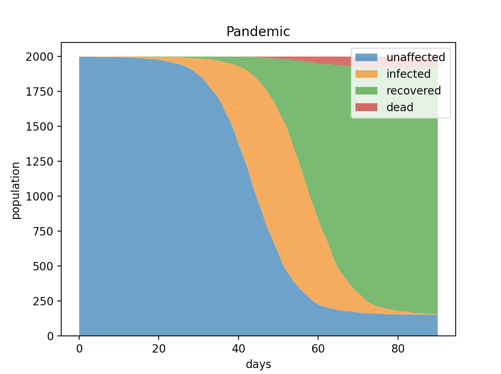

# Pandemic simulation (v1)

## Description

This is the first version of a basic pandemic simulator

this is the resulting graph:

It shows what happens in different scenarios. For example, we can change the death rate of the simulated pandemic.

## instructions

1. install the packages from requirements.txt
   1. Note there are unused packages in this version
2. chose values for vars in main.py
3. run main.py

## Notes

### known issues

- no grouping of people
- people are always sick for the spread_time (no randomness)
- people die only at the end of the spread_time
- unnecessary checks are made (bad performance)

### future versions of the simulation will include

- removed redundant checks
- better simulate groups and communities
- better simulate the sickness period
- add variables (masks, quarantine, policies, etc)